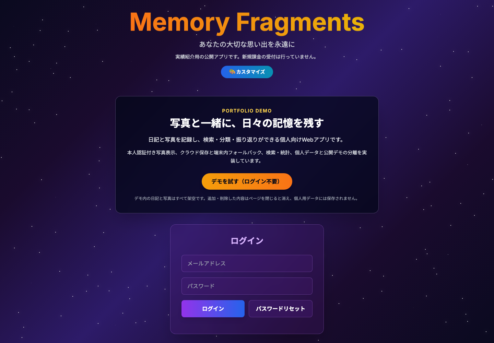
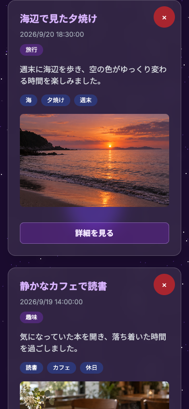

# Memory Fragments

写真と一緒に日々の記憶を残し、検索・分類・振り返りができる個人向けWeb日記アプリです。

[](https://github.com/hiros0921/memory-fragments/actions/workflows/ci.yml)

- **本番サイト:** https://www.memory-fragments.com/
- **ログイン不要デモ:** https://www.memory-fragments.com/?demo=true
- **公開デモの説明:** [docs/public-demo.md](docs/public-demo.md)

公開デモには架空の日記と生成画像だけを収録しています。ログイン、個人データ、Firebaseへの書き込みは使用しません。

## 画面例

### PC版トップページ



### スマートフォン版公開デモ



## 実装済み

| 分類 | 内容 |
|---|---|
| 記録 | タイトル、本文、カテゴリー、タグ、写真1枚、任意の位置情報を保存 |
| 閲覧 | 一覧表示、詳細表示、削除、年月・カテゴリー別の統計 |
| 検索 | キーワード、期間、カテゴリー、タグによる絞り込み |
| 認証 | Firebase Authenticationによる利用者の識別 |
| 保存 | Firestoreへのクラウド保存。失敗時は利用者単位のブラウザー内保存へフォールバック |
| 写真 | Firebase Storageへ保存し、ログイン本人の認証情報を使って表示 |
| 書き出し | JSON、CSV、テキスト、HTMLの4形式 |
| 公開デモ | 個人用データと分離したメモリ内ストアで、追加・検索・絞り込み・詳細・削除を体験可能 |
| 配信 | 許可リスト方式の静的ビルドをVercelから配信 |

保存結果は「クラウドに保存」「この端末のブラウザーだけに保存」「保存できなかった」を画面上で区別します。端末内だけの日記は自動同期されません。

## 自動テストで検証済み

Node.jsのテストランナー、JSDOM、Firebase Emulatorを使い、次の境界を自動検証しています。

- 公開デモが認証・Firestore・Storage・位置情報を起動せず、個人データへ到達しないこと
- 日記のクラウド保存成功、端末内フォールバック、容量不足、アカウント切替時の分離
- 写真を所有者本人だけが閲覧・変更でき、別利用者や未ログイン利用者は拒否されること
- 一般利用者が有料会員情報を書き換えられず、信頼されたサーバー更新は維持されること
- 4形式の書き出し、日付・日本時間、HTMLエスケープ、CSV数式対策、失敗時の表示
- 公開ビルドに旧版、テスト、ルール、ログ、決済コードが混入しないこと

```bash
npm test
npm run build
```

`npm test` はFirestoreとStorageのエミュレーターを起動し、実際のセキュリティルールを含むテストを実行します。本番データや実決済は使用しません。

## 技術構成

```text
ブラウザー
  ├─ HTML / Tailwind CSS / JavaScript
  ├─ Firebase Authentication
  ├─ Firestore（本人の日記）
  ├─ Firebase Storage（本人の写真）
  └─ localStorage（クラウド保存失敗時の端末内フォールバック）

ログイン不要デモ
  └─ ページ内メモリだけを使う独立ストア

テスト
  ├─ Node.js test runner / JSDOM
  └─ Firebase Emulator（Firestore / Storage）

配信
  └─ Vercel（25ファイルの公開許可リスト）
```

現行画面は `index.html`、アプリケーションサービスは `js/app/`、公開対象は `scripts/build-static.cjs` に集約しています。

## 改善事例

機能を増やすだけでなく、既存実装の問題を確認し、境界を明確にしてから修正しました。

| 問題 | 原因 | 対応 | 検証 |
|---|---|---|---|
| 写真URLを知る第三者がアクセスできる可能性 | 共有用ダウンロードURLを表示に利用 | 所有者パスを保存し、表示時に本人の認証トークンで取得 | 所有者・別利用者・未ログイン・ログアウト途中を自動テスト |
| 利用者側から有料会員情報を変更できる | 課金関連フィールドを通常のプロフィール更新と同じ権限で扱っていた | Firestoreルールで課金フィールドをサーバー管理に限定 | 作成・変更・削除・アカウント切替・管理SDK更新をエミュレーターで確認 |
| クラウド保存失敗時に保存先が分かりにくい | クラウドと端末内保存の結果表示が混在 | 保存処理をサービス層へ分け、保存先と失敗を別のメッセージで表示 | 成功、通信失敗、端末容量不足、再試行をテスト |
| 書き出し形式ごとに日付や安全対策が不統一 | ISO日時、Firebase Timestamp、文字列の扱いが分散 | 日本時間の正規化と各形式のエスケープ処理を統一 | タイムゾーン、うるう日、不正日付、HTML、CSVをテスト |
| 面談担当者がアカウントなしで試せない | 本人用ログイン画面しかなかった | 架空データだけのメモリストアを追加し、個人用経路から分離 | 認証監視やFirebaseアクセスが発生しないことをテスト |
| 開発途中のファイルが本番へ混入し得る | 配信対象がリポジトリ構成に依存 | 公開資産を明示した許可リスト方式へ変更 | ビルド内容とVercelアップロード対象をテスト |

詳しい判断と検証範囲は次の文書に残しています。

- [写真アクセスと公開ビルド](docs/public-demo.md)
- [有料会員情報の保護](docs/premium-state-protection.md)
- [日記の書き出しと日付](docs/diary-exports.md)
- [公開画面から課金導線を外した判断](docs/portfolio-no-checkout.md)

## 制約・未対応

- 公開デモの追加・削除はページ内メモリだけに保存され、再読み込みすると初期の架空データ3件へ戻ります。
- 実績紹介用の公開アプリとして運用しており、**新規課金の受付は行っていません**。過去の決済コードは参考資料としてのみ保存しています。
- クラウド保存に失敗して端末内だけに保存された日記は、自動でクラウドへ同期されません。
- 書き出しは日記データの確認用です。写真を含む完全なバックアップ・復元機能ではありません。
- 保存済み日記を編集する画面は未実装です。現在は追加、閲覧、検索、削除に対応しています。
- 位置情報とブラウザー通知は、端末・ブラウザー・利用者の権限設定によって利用できない場合があります。

## ローカルで確認する

### 必要な環境

- Node.js 22
- Java 21（Firebase Emulator用）

### セットアップと検証

```bash
npm ci
npm test
npm run build
```

`npm run build` は `dist/` に現在の公開対象だけを生成します。秘密情報、Firebaseルール、テスト、旧版、アーカイブは含みません。

## 旧版と決済コード

開発途中の画面・試験用ファイル・過去の設定メモは削除せず、[`archive/`](archive/) に分類しました。アーカイブ内は本番未使用で、動作保証の対象外です。

過去の決済実装は次に保存しています。

- ブラウザー側の参考コード: [`examples/checkout-reference.js`](examples/checkout-reference.js)
- サーバー側の参考コード: [`archive/payment-reference/functions/index.js`](archive/payment-reference/functions/index.js)

どちらも公開ビルドには含まれず、現在のサイトから呼び出す導線はありません。

---

株式会社LIGHTECH　諏訪裕之
